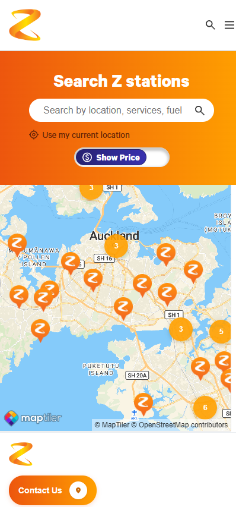

# Z Energy

### Find a service station near you!

## Table of Contents
- [Features](#features)
- [MERN Tech Stack](#mern-tech-stack)
- [Structure](#structure)
- [Get Started](#get-started)
- [Authors](#authors)

{ style="display: block; margin: 0 auto" }


## Features

- **Interactive Map**: See nearby fuel stations
- **Search Functionality**: Search by location, services, or fuel types
- **Filtering**: Filter stations based on viewport or preferences
- **Responsive Design**: Usable on desktop and mobile devices

## MERN Tech Stack

### Frontend

- [](#)
- [](#)
- [MapTiler SDK](https://www.maptiler.com/)

### Backend

- [](#)
- [](#)
- [](#)

## Structure

```
mission5
├── backend/            # Server-side Node.js app
│   ├── data/           # Static data files (JSON datasets)
│   ├── middleware/     
│   ├── models/         # Database models/schemas (MongoDB/Mongoose)
│   ├── routes/         # API endpoints
│   └── util/           
└── frontend/           # Client-side React app
    ├── public/          
    └── src/            # React source code
        ├── assets/     # Dynamic assets (images, icons, media)
        ├── components/ 
        |   └── shared/ # Header, footer and results menu
        ├── constants/  # Map configuration values
        └── styles/     # CSS files (variables, fonts)
├── .env.example        
└── README.md


```

## Get Started

### 1. Clone the Repo

```bash
git clone https://github.com/zetapow/mission5.git
cd mission5
```

### 2. Install Dependencies

Backend:

```bash
cd backend
npm install
```

Frontend:

```bash
cd ../frontend
npm install
```

### 3. Set Up Environment Variables

Copy `.env.example` to `.env` in both backend and frontend folders and update values as needed.

### 4. Run the App Locally

Backend:

```bash
cd backend
npm run dev
```

Frontend (React):

```bash
cd ../frontend
npm run dev
```

The frontend will typically be available at [http://localhost:5173](http://localhost:5173)  
The backend API will typically run at [http://localhost:4000](http://localhost:4000)

## Authors

### Design

- [@Kere M.](mailto:Kerem@missionreadyhq.com)
- [@Jennifer V.](mailto:Jennifervu@missionreadyhq.com)

### Development

- [@Eugene L.](https://github.com/Eule034430) - Search Component
- [@Adam T.](https://github.com/AdamT-HJ) - Results Component
- [@Peter Z.](https://github.com/zetapow) - Map Component
